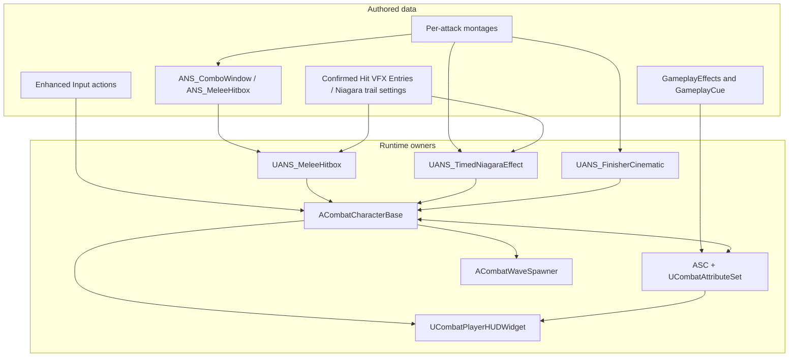
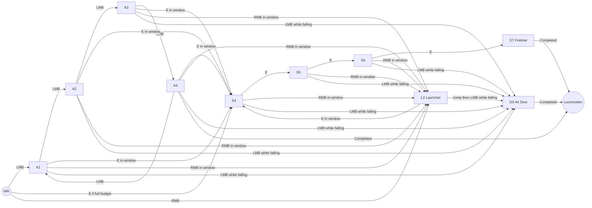
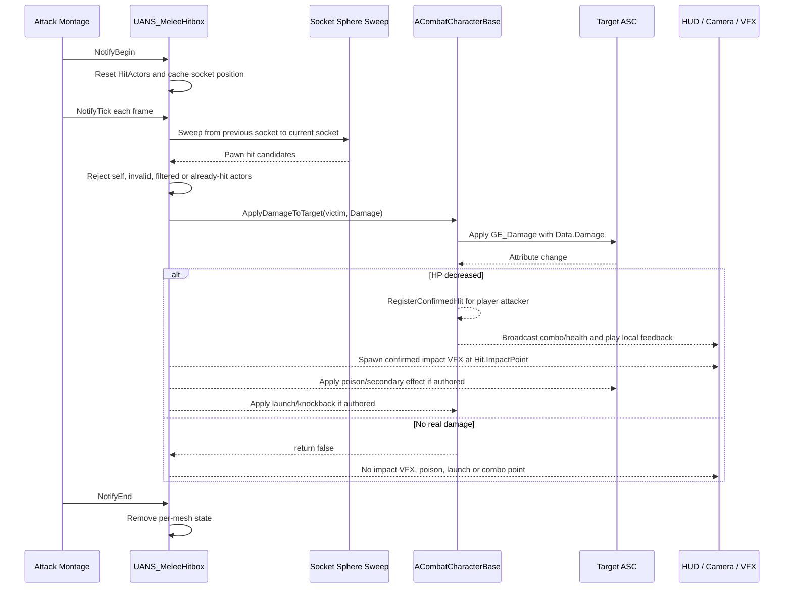
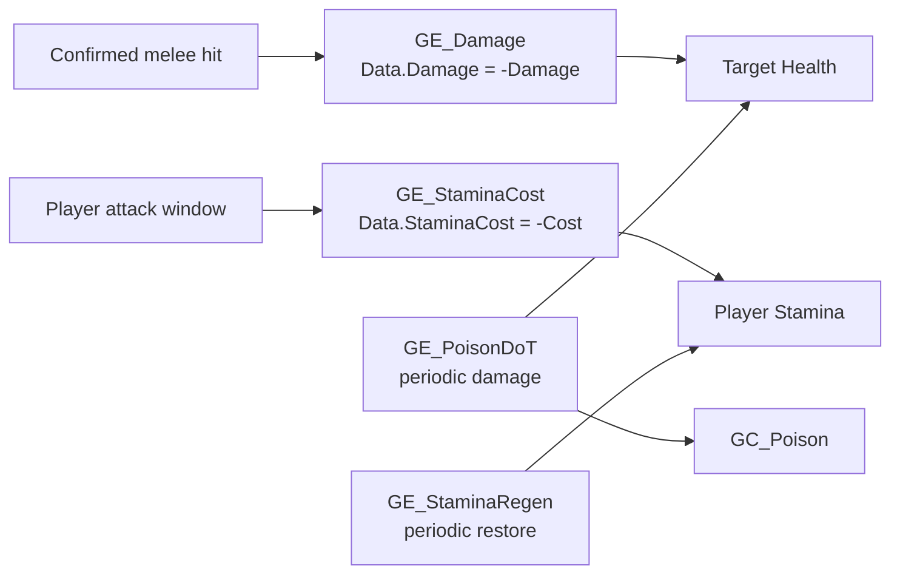
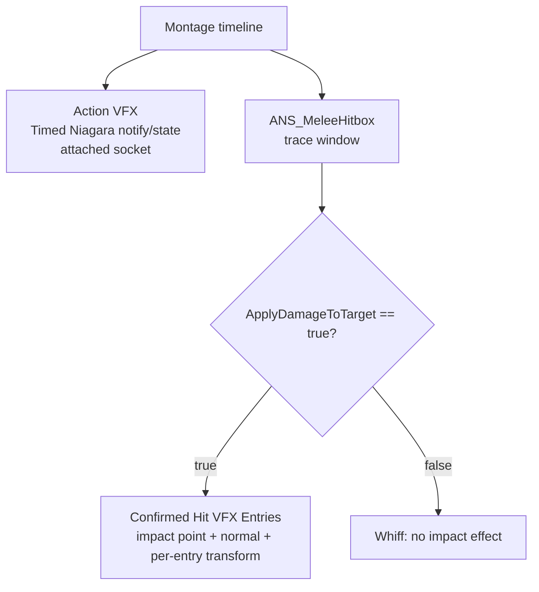
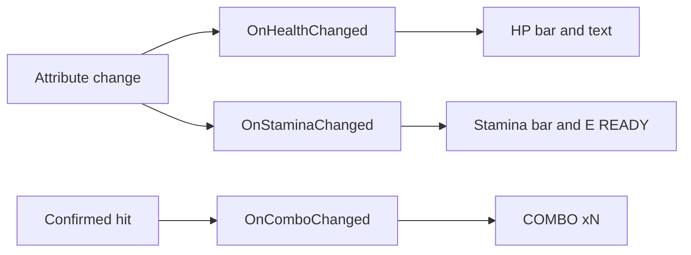
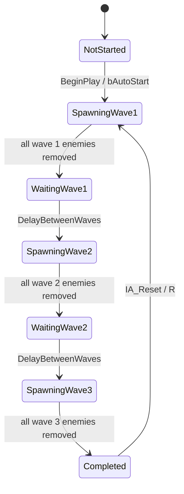

# Combat Architecture — Runtime Ownership and Extension Guide

**Project:** `aether_test`
**Engine:** Unreal Engine 5.4.4
**Purpose:** source-level explanation of the combat prototype submitted for Game Combat Engineer Test 1
**Current scope:** combo combat, confirmed damage, GAS, VFX, camera, HUD, enemies and wave reset

## 1. Architectural goals

The prototype uses the narrowest practical split for a single-player Unreal test:

1. Animation owns timing and authored move data.
2. Native C++ owns rules that must be consistent across player and enemy paths.
3. GAS owns attribute/effect application.
4. Event delegates connect gameplay state to HUD and wave progression.
5. Cosmetic action feedback is kept separate from confirmed gameplay feedback.

The result is a data-driven combat slice without a speculative framework. Adding an attack should mostly mean adding or editing a montage and its notify properties.

## 2. Runtime ownership map

| Responsibility | Owner | Public contract |
|---|---|---|
| ASC, attributes, damage authority, stamina helpers, combo streak, camera and cleanup | `ACombatCharacterBase` | `ApplyDamageToTarget`, `TryPayStamina`, delegates, camera API |
| Health/max health/stamina/max stamina and clamping | `UCombatAttributeSet` | GAS attributes and accessors |
| Authored melee window, socket sweep, per-window dedupe | `UANS_MeleeHitbox` | `NotifyBegin`, `NotifyTick`, `NotifyEnd` |
| Combo lane, montage arrays, buffer and input routing | `BP_ThirdPersonCharacter` | `StartCombo`, `AdvanceGround`, `AdvanceSkill`, `DoLauncher`, air route |
| Timed socket-following trail | `UANS_TimedNiagaraEffect` | `Template`, `SocketName`, offsets, scale, cleanup |
| S7 cinematic window | `UANS_FinisherCinematic` | `FFinisherCinematicSettings` → character camera API |
| Enemy chase/attack presentation | `BP_Enemy` | Blueprint movement and authored enemy montage |
| Wave lifecycle | `ACombatWaveSpawner` | `StartWaves`, `ResetWaves`, wave delegates |
| Screen HUD | `UCombatPlayerHUDWidget` | delegate subscriptions and native UMG layout |
| Combat camera shake | `UCombatHitCameraShake` | local confirmed-hit feedback |



## 3. Combo state machine

### 3.1 Move vocabulary

| Lane | Moves | Montage assets | Entry |
|---|---|---|---|
| Ground | A1–A4 | `AM_Ground_A1` … `AM_Ground_A4` | `LMB` |
| Launcher | L2 | `AM_Launcher_L2` | `RMB` |
| Skill | S4–S7 | `AM_Skill_S4` … `AM_Skill_S7` | `E` |
| Air | D3 | `AM_Dive_D3` | attack input while `IsFalling` |

The labels are gameplay vocabulary, not a second runtime type system. The Blueprint keeps the current montage array and index, while native notify code handles timing-sensitive gameplay.

### 3.2 Complete route diagram



### 3.3 State and callback invariants

The authored Blueprint state is intentionally small:

```text
bIsAttacking
bIsComboWindowOpen
bSkillCombo
bIsAirCombo
ComboIndex
CurrentCombo
BufferedInput       // 0 none, 1 LMB, 2 E, 3 RMB
```

The key invariants are:

- `ANS_ComboWindow` opens and closes the input window; it does not decide damage.
- Same-lane input advances the current array.
- Cross-lane input sets the new array and resets `ComboIndex` to `-1` before advancing.
- Input received outside the window stores its key in `BufferedInput`.
- `AdvanceGround` checks `IsFalling` before normal ground routing, so airborne input cannot accidentally play a ground montage.
- `On Completed` reaches `ResetCombo`, which restores movement and clears combat state.
- `On Interrupted` and `On Blend Out` are intentionally not reset callbacks; the next montage in a chain interrupts the previous montage by design.

The per-attack montage architecture was selected after comparing it with one montage plus sections. Independent montages provide normal blending across different source clips, remove section-name/link management, and let each move carry its own notify data.

## 4. Confirmed hit pipeline



`ApplyDamageToTarget()` is the single gameplay confirmation gate. It rejects dead actors, missing effect wiring, invalid damage and unchanged HP. This prevents a trace overlap from being mistaken for a hit.

The unit of hit accounting is:

```text
one attacker × one living victim × one active notify window × real HP decrease
= one confirmed hit
```

As a consequence, a single window that damages three enemies adds three points to the player's confirmed-hit streak. The HUD value `COMBO xN` is intentionally not the number of montage assets played.

## 5. GAS and resource policy

`ACombatCharacterBase` owns an ASC and a shared `UCombatAttributeSet` for both player and enemy. The attribute set initializes and clamps `Health`, `MaxHealth`, `Stamina` and `MaxStamina`.



Resource decisions:

- Player startup stamina is initialized to `50%` of maximum.
- The four-hit E lane has a `SkillComboTotalCost` of `50`, split into `12.5` per S4–S7 hit window.
- S4 checks the full budget; each E hit window owns its own payment so interruption/whiff behavior remains tied to authored windows.
- `GE_StaminaRegen` restores stamina over time.
- Normal confirmed player hits may restore a configured amount, clamped to maximum; E windows do not refund stamina.
- `GE_PoisonDoT` and `GC_Poison` are applied only from a confirmed enemy hit path.

## 6. VFX trigger contract

The project has two separate cosmetic lanes:



`UANS_TimedNiagaraEffect` owns a socket-attached component per mesh, with explicit `Template`, `SocketName`, location/rotation offsets, scale and end cleanup. The current E lane uses the project-owned `NS_ECombo_ElectricTrail` on `hand_r` across S4–S7.

`UANS_MeleeHitbox` exposes one visible `Confirmed Hit VFX` array of `FConfirmedHitVFXEntry` values. Each entry supports:

- Niagara or Cascade effect;
- local location offset;
- local rotation offset;
- independent scale;
- optional alignment of local Z to the impact normal.

The runtime spawns entries only after real HP loss. Legacy fields remain hidden and serialized solely to preserve old montage data; the unified entry array takes precedence when populated.

## 7. Camera, cinematic and HUD ownership

### Camera

The existing Blueprint SpringArm and Camera components remain the physical camera. Native code supplies the combat policy:

- target-aware arm length and FOV interpolation;
- torso framing offset (`+40uu` target offset);
- translation lag `8`, rotation lag `10`, max lag distance `90uu`;
- camera collision remains enabled against world geometry;
- combat character capsule/mesh ignore `ECC_Camera` to prevent enemy-body zoom;
- hit shake runs only for the local player and only after confirmed damage.

The S7 `FinisherCinematicWindow` is an animation adapter around `BeginFinisherCinematic()` and `EndFinisherCinematic()`. It temporarily drives orbit/framing and global time dilation, then restores control rotation, spring-arm values, FOV and time dilation on normal end, montage change, death or `EndPlay`.

### HUD

`UCombatPlayerHUDWidget` constructs its native UMG hierarchy once and subscribes to delegates:



The widget does not calculate damage, inspect hitboxes or poll every frame. It renders values already owned by the character/GAS layer.

## 8. Wave lifecycle and reset contract



`ACombatWaveSpawner` is event-driven and does not need a Tick loop. `OnCharacterDied` advances the logical state immediately; `OnDestroyed` is a safety fallback for actors removed outside the damage path. `ResetWaves()` clears both spawn timers, unregisters delegates, destroys tracked live enemies, resets state, and calls `StartWaves()`.

The character binds the existing `/Game/ThirdPerson/Input/Actions/IA_Reset` action natively in `SetupPlayerInputComponent()`. The handler resets completed spawners in the current world and ignores early input while the run is still active. Keeping reset ownership in the spawner means the input layer remains a thin adapter and the lifecycle cleanup has one owner.

## 9. SOLID assessment

| Principle | Current design | Why it matters |
|---|---|---|
| Single Responsibility | `UCombatAttributeSet`, `UANS_MeleeHitbox`, `UANS_TimedNiagaraEffect`, `UANS_FinisherCinematic`, HUD and wave spawner each own a bounded concern. The character is a bounded combat facade for this single-player test. | A bug in VFX timing does not require changing damage math. |
| Open/Closed | Montage arrays and notify properties extend attack behavior. | New moves usually require data, not copied C++. |
| Liskov Substitution | `BP_ThirdPersonCharacter` and `BP_Enemy` share `ACombatCharacterBase` for GAS, damage, death and hit reactions. | Damage/death/GAS logic is consistent for both actor types. |
| Interface Segregation | Delegates expose narrow health, stamina, combo and death signals. | HUD and spawner avoid depending on unrelated actor internals. |
| Dependency Inversion | Gameplay effects and event contracts sit between producers and consumers. | Presentation and wave progression react to events rather than polling implementation details. |

The only intentionally broad class is `ACombatCharacterBase`, which remains the bounded orchestration/facade for this single-player assignment. Extracting multiple components now would increase migration surface without a second consumer. The next justified extraction would be driven by a second playable archetype, multiplayer ownership or a reusable camera/targeting consumer.

## 10. Design patterns

- **Facade/orchestrator:** `ACombatCharacterBase` presents the small combat API used by notifies and Blueprint.
- **Adapter:** animation notify/state classes translate timeline callbacks into traces, Niagara attachment and camera control.
- **Observer:** GAS and character delegates feed HUD and wave state without Tick polling.
- **Data-driven Strategy:** montage arrays, notify properties, VFX entries and GameplayEffects select behavior.
- **State machine:** combo lane/window/buffer transitions and wave progression are explicit and converge on cleanup methods.

## 11. Extension rules

### Add a normal attack

1. Create/retarget the animation sequence.
2. Trim an independent montage under `Content/Game/Combat/Montages`.
3. Add it to the appropriate Blueprint montage array.
4. Add `ANS_ComboWindow` around the measured contact frame.
5. Add `ANS_MeleeHitbox` with socket, radius, damage and optional confirmed-hit feedback.
6. Add an attached `UANS_TimedNiagaraEffect` only if the attack needs an action trail.

No new damage resolver or combo counter is required.

### Add a multi-hit attack

Use multiple authored hitbox activations. The per-activation `HitActors` set prevents accidental per-frame repeats while allowing the same victim to be hit by a later intentional window.

### Add a new confirmed impact effect

Add an entry to the visible `Confirmed Hit VFX` array and tune its transform there. Keep it out of the action trail lane so a whiff cannot create a false impact cue.

### Add a new wave

Add a `FCombatWaveDefinition` entry on the placed `BP_WaveSpawner` actor. The spawner already owns enemy tracking, completion and transition timing.

## 12. Verification record

The current checkout was built for both game and editor targets on UE 5.4.4. Focused PIE traces verified:

- damage starts from authored hit windows rather than capsule proximity;
- confirmed effects and combo accounting follow real HP decrease;
- enemy wave completion advances without Tick polling;
- final-wave completion plus actual keyboard `R` produces the reset log and starts wave 1;
- early `R` input is ignored;
- timed Niagara components clean up after the E trail window;
- recent PIE log scan has no new project `LogTemp`, Blueprint, Niagara or Material errors.

Perfect dodge is not part of this Test 1 implementation; it belongs to Test 2 and is intentionally not represented as a shipped feature here.
