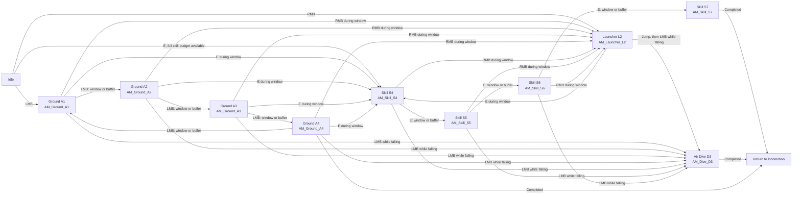
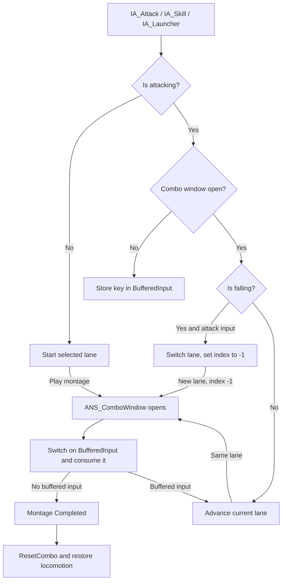
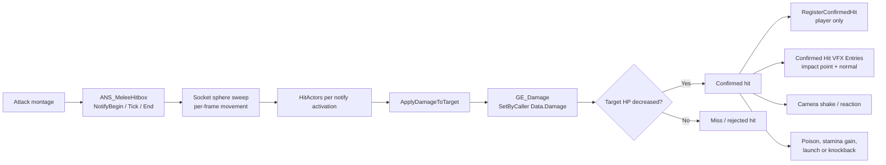
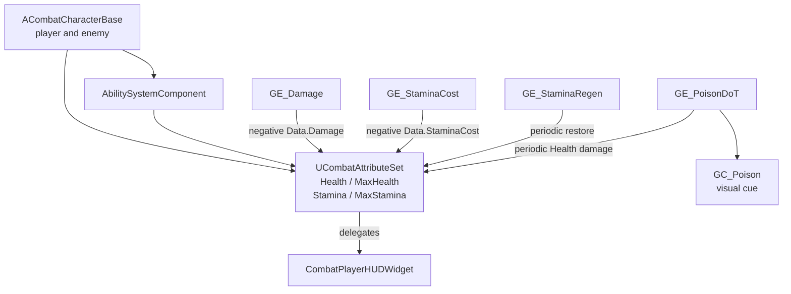
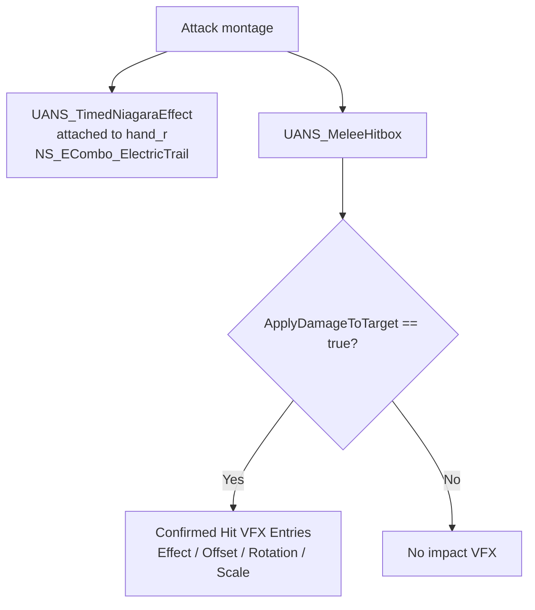
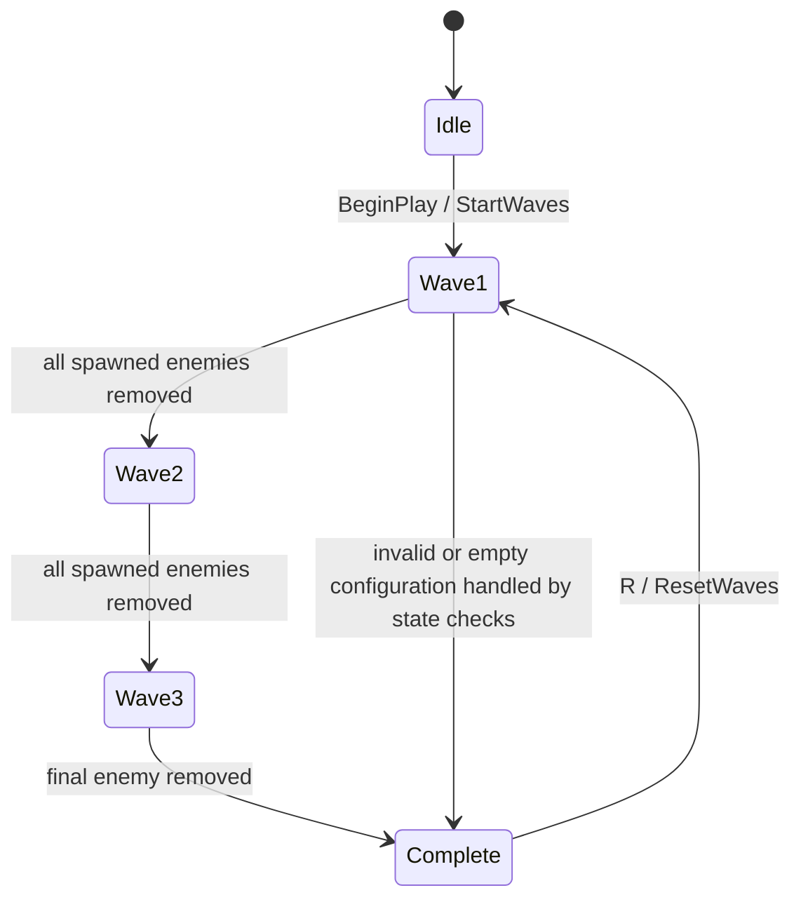
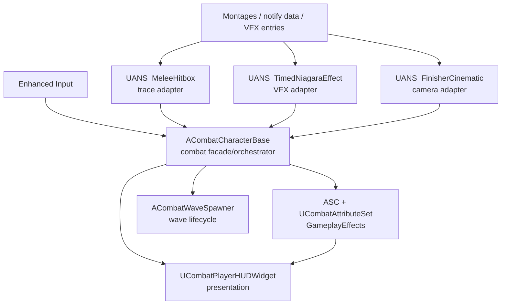

# Technical Document — Hack & Slash Combat Prototype

**Project:** `aether_test`
**Engine:** Unreal Engine 5.4.4
**Target:** Windows PC
**Status:** Combat prototype complete for Game Combat Engineer Test 1
**Author:** Nguyen Nguyen

## 1. Overview

This prototype is a third-person hack-and-slash combat slice built on Unreal Engine's Third Person template. It demonstrates montage-driven melee combat, data-authored combo branches, Gameplay Ability System attributes/effects, enemy wave progression, dynamic camera feedback, HUD presentation, and animation-timed VFX.

The combat rules are split between native C++ systems that need gameplay authority and Blueprint/animation data that is faster to tune. A new attack is normally created by adding an animation montage and configuring its notify window; the trace, damage, stamina, combo, VFX, and feedback code is reused.

## 2. Feature coverage

| Requirement | Implementation |
|---|---|
| Montage melee combat | One independent `AnimMontage` per authored attack |
| 5+ attack combinations | Ground chain, skill chain, launcher link, air dive, and cross-lane branches |
| Ground combo | `AM_Ground_A1` → `A2` → `A3` → `A4` |
| Skill combo | `AM_Skill_S4` → `S5` → `S6` → `S7` |
| Air combat | `AM_Dive_D3`, selected whenever attack input is routed while falling |
| GAS attributes | `UCombatAttributeSet`: Health, MaxHealth, Stamina, MaxStamina |
| Gameplay Effects | Damage, stamina cost, stamina regeneration, poison DoT |
| Gameplay Cue | `GC_Poison` provides the poison visual indicator |
| Dynamic camera | SpringArm lag, combat framing, target-aware arm/FOV, hit shake, S7 orbit |
| HUD | Native UMG for HP, stamina, E readiness, combo streak, enemy HP bars |
| Enemy/wave loop | Event-driven `ACombatWaveSpawner`, three configured waves |
| Test iteration | Press `R` after the final wave to reset and start wave 1 again |

## 3. Controls and demo flow

| Input | Action |
|---|---|
| `WASD` | Move |
| Mouse movement | Camera look |
| `LMB` | Ground attack / continue ground chain |
| `E` | Skill chain / switch into the skill lane during a window |
| `RMB` | Launcher `L2`, usable from idle or an open combo window |
| `Space` | Jump; attack while airborne routes to the air dive |
| `R` | Reset the completed three-wave run and restart from wave 1 |

Suggested video order:

1. Show the HUD and the three enemy waves.
2. Demonstrate the four-hit ground chain with `LMB`.
3. Demonstrate `RMB` launcher, then `E` to continue into `S4–S7`.
4. Demonstrate jump/airborne routing into `D3`.
5. Show a confirmed hit: HP loss, combo increase, hit VFX and camera shake.
6. Let the final wave finish, press `R`, and show wave 1 spawning again without leaving the level.

## 4. Combo grammar

The shipped moveset is a small state machine rather than a fixed animation movie. `LMB`, `E`, and `RMB` select or switch lanes only during an authored combo window. A press that arrives slightly early is stored in `BufferedInput` and consumed when the next window opens.



### 4.1 Why one montage per attack

The source animation pack contains combo-string clips. An early implementation used montage sections and `Montage_JumpToSection`, but that produced hard cuts when switching between source clips. The final implementation trims the authored clips into independent montages and plays the next asset with normal montage blending.

| Decision | Shipped approach |
|---|---|
| Asset unit | One montage per attack |
| Chain selection | `TArray<AnimMontage>` plus `ComboIndex` |
| Transition | Montage blend, approximately `0.1s` in / `0.15s` out |
| Timing | `ANS_ComboWindow` around the measured contact frame |
| Extending a chain | Add an asset to the appropriate array and author its notify window |

This makes the combo definition data-driven. The combat resolver does not need a new C++ branch for every attack.

### 4.2 Input state and buffering



The buffer stores the key, not only a Boolean. `BufferedInput` uses `0 = none`, `1 = attack`, `2 = skill`, and `3 = launcher`. This prevents an early `E` from accidentally advancing the ground array after a ground finisher.

`On Completed` is the normal cleanup path. `On Interrupted` and `On Blend Out` are intentionally not wired to reset the combo because playing the next montage is itself the normal interruption path for a chain.

### 4.3 Air design

The final air design uses root motion from the attack montages. A single `IsFalling` decision in `AdvanceGround` routes attack input to the air lane, including input received in the middle of a ground or skill sequence. This removed the earlier low-gravity/impulse prototype and its gravity-restore edge cases.

The launcher remains the intentional vertical entry point and applies a `650uu` vertical launch on confirmed hit. It is also a normal combo-window participant, so `L2 → E` and `L2 → jump → air attack` are both authored routes.

## 5. Authoritative combat and GAS flow



`UANS_MeleeHitbox` is animation-timed, but it is not the authority for whether damage happened. `ACombatCharacterBase::ApplyDamageToTarget()` applies `GE_Damage`, compares target HP before and after, and returns `true` only when the target really lost HP. Poison, launch, hit reaction, camera shake, VFX and combo accounting are downstream of that result.

The per-window `HitActors` set prevents repeated notify ticks from damaging the same victim continuously. A later authored notify window may hit the same victim again, which is how deliberate multi-hit attacks remain possible.

## 6. GAS attributes and effects



Key rules:

- Native defaults are `Health = 100`, `MaxHealth = 100`, `Stamina = 100`, `MaxStamina = 100`; attributes are clamped to valid ranges.
- The player starts at `50%` stamina so the E budget is visible in the demo.
- One complete four-hit E chain has a `50` stamina budget, split into four `12.5` payments at the authored S4–S7 hit windows. S4 owns the full-budget gate; later windows own their individual payments.
- Normal confirmed player hits can restore configured stamina, bounded by `MaxStamina`; E windows do not refund stamina.
- Poison is applied only after a confirmed enemy hit. The configured DoT is periodic and uses refresh-not-add stacking.

## 7. VFX, camera and HUD separation

### VFX contract



Action VFX and confirmed-hit VFX are intentionally different:

- A trail describes the attack and may play on a whiff. The electric E trail is attached to `hand_r` for the S4–S7 montages and owns its own socket transform and lifetime.
- A confirmed impact represents gameplay truth. `Confirmed Hit VFX Entries` is the single visible hitbox list; each entry has an effect, location offset, rotation offset, scale and optional hit-normal alignment.
- Confirmed impact effects spawn at `FHitResult::ImpactPoint`, use the hit normal for orientation, and are deduplicated per victim per notify window.
- The old single-slot/list fields remain hidden only for serialized backward compatibility. When unified entries exist, they are the active path.

### Camera and presentation

`ACombatCharacterBase` keeps the existing Blueprint SpringArm and Camera components. Native code adds combat-aware arm/FOV interpolation, upper-body target offset, translation/rotation lag and local confirmed-hit shake. World collision remains enabled on the SpringArm; combat character primitives ignore the camera channel so enemies do not collapse the arm into the player.

The S7 `FinisherCinematicWindow` notify temporarily owns camera rotation/framing and global time dilation. `EndFinisherCinematic()` restores control rotation, arm length, target offset, FOV and time dilation on notify end, montage change, death or `EndPlay`.

`UCombatPlayerHUDWidget` is event-driven rather than Tick-driven:

```text
GAS attribute change -> ACombatCharacterBase delegate -> UCombatPlayerHUDWidget
Health               -> OnHealthChanged              -> HP bar/text
Stamina              -> OnStaminaChanged             -> stamina bar + E READY
Confirmed hit        -> OnComboChanged               -> COMBO xN
```

The combo number is a confirmed-hit streak, not the number of animation clips played. Multi-target windows can therefore add multiple combo points.

## 8. Enemy waves and rapid test iteration



`ACombatWaveSpawner` owns wave state and uses delegates rather than polling every frame:

- `OnCharacterDied` is the primary logical completion signal.
- `OnDestroyed` is a deduplicated fallback for external removal.
- `ActiveEnemies` tracks only live spawned actors.
- `DelayBetweenWaves` defaults to `2.5s`.
- `HasCompletedAllWaves()` becomes true after the final wave is clear, including the short final delay.
- `ResetWaves()` clears timers, unregisters callbacks, removes/destroys active enemies, resets the index/state, and calls `StartWaves()`.
- The existing `IA_Reset` action is bound to native `SetupPlayerInputComponent`; `R` is ignored while a run is still active.

## 9. OOP, SOLID and design patterns



| Principle/pattern | Application |
|---|---|
| Single Responsibility | Attributes, hit windows, VFX attachment, cinematic window, HUD and wave lifecycle have separate owners. The character is a bounded combat facade for this single-player test. |
| Open/Closed | New moves are added through montage arrays and notify data; the damage resolver is not copied per attack. |
| Liskov Substitution | Player and enemy Blueprint children share `ACombatCharacterBase` for GAS, damage, death and hit reactions. |
| Interface Segregation | Consumers use small delegates (`OnHealthChanged`, `OnStaminaChanged`, `OnComboChanged`, `OnCharacterDied`) instead of polling the entire actor. |
| Dependency Inversion | Damage/effect authority is routed through GAS and the character contract; presentation reacts to events. |
| Adapter | Animation notify/state classes translate timeline callbacks into traces, Niagara attachment and camera behavior. |
| Observer | GAS changes and character death broadcast to HUD and wave systems. |
| Data-driven Strategy | Montage arrays, notify properties, VFX entries and GameplayEffects select attack behavior without a class per move. |
| State machine | Combo lane/window/buffer state and wave progression have explicit transitions and cleanup paths. |

The project intentionally does not introduce a generic combat framework or factory hierarchy for a single playable character. If the prototype grows to multiple combat archetypes, multiplayer ownership or several independent consumers, the safe next refactor is to extract focused `UActorComponent`s behind the existing character API.

## 10. Verification and scope

Verified on UE 5.4.4:

- `aether_test` game target: UHT, compile and link pass.
- `aether_testEditor` target: UHT, compile and link pass.
- PIE runtime: ground/skill hit confirmation, wave progression, HUD initialization, camera/VFX smoke paths and `R` wave reset were exercised.
- Reset test: final wave reported complete (`CurrentWaveIndex = 3` after completion); pressing `R` logged a reset and restarted wave 1. Pressing `R` before completion was ignored.
- Recent PIE log scan contained no new `LogTemp: Error`, Blueprint, Niagara or Material errors for the tested flow.

Perfect dodge is intentionally outside this Test 1 submission scope; it belongs to the separate Test 2 requirement. The packaged executable and this document are the hand-off artifacts for the recruitment submission.
